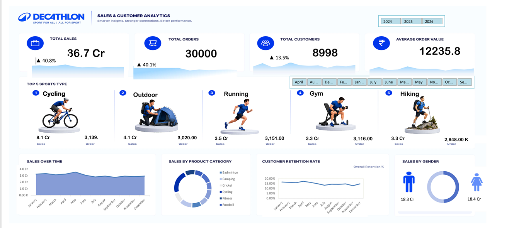

# Decathlon-Sales
# Decathlon Sales Dashboard 📊

An interactive **Excel Sales Dashboard** created to analyze Decathlon sales performance, product categories, and yearly/monthly trends.

## 📌 Project Overview

This project presents an interactive sales dashboard designed to transform sales data into meaningful visual insights. The dashboard helps analyze sales performance across different sports and product categories and provides a clear view of business trends over time.

## 🛠️ Tools & Technologies

* Microsoft Excel
* Pivot Tables
* Pivot Charts
* Slicers
* Data Visualization
* Excel Dashboard Design
* Data Analysis

## 📊 Dashboard Features

* Interactive sales analysis
* Category-wise sales performance
* Year-wise sales trends
* Monthly sales analysis
* Sports/category comparison
* KPI cards for important business metrics
* Interactive filters using Slicers
* Visual charts for quick decision-making

## 🏆 Categories Analyzed

The dashboard includes categories such as:

* Cycling
* Outdoor
* Running
* Gym
* Hiking
* Badminton
* Camping
* Cricket
* Fitness
* Football

## 📈 Key Insights

The dashboard provides insights into:

* Overall sales performance
* Sales growth across different years
* Top-performing categories
* Monthly sales trends
* Comparison between different sports/categories
* Changes in sales performance over time

The dashboard includes yearly analysis for **2024, 2025, and 2026**, along with category-level sales information.

## 🎯 Project Objective

The main objective of this project is to practice **data analysis and visualization using Microsoft Excel** and create an interactive dashboard that can help users understand sales performance and identify important business trends.

## 📷 Dashboard Preview

## 📂 Project Files

* `Decathlon_Dashboard.xlsm` — Complete interactive Excel dashboard
* `Dashboard_Preview.png` — Dashboard preview image

## 💡 Skills Demonstrated

* Data Analysis
* Excel Dashboard Development
* Data Visualization
* Pivot Tables & Pivot Charts
* Slicer Implementation
* Business Data Interpretation
* Microsoft Excel

## 👩‍💻 Author

**Saba Najam**

BS Artificial Intelligence Student
Interested in Data Analytics, Artificial Intelligence & Machine Learning

